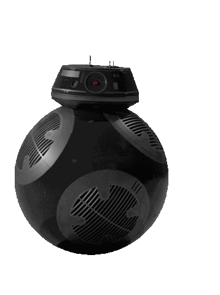

<a href="https://pprkut.com/"></a>


<a href="https://discord.com/channels/@me/299152387728343043">
  
</a>
<a href="https://twitter.com/x0rCTF">
  
</a>
<a href="https://www.linkedin.com/in/crix0r/">
  
</a>
<a href="https://www.instagram.com/pprkutt/">
  
</a>

<a href="https://tryhackme.com/p/e1ee7">
  
</a>

<a href="https://app.hackthebox.com/profile/107301">
  
</a>

<a href="https://steamcommunity.com/id/Raizeyourweapon/">
  
</a>


<br/>

##### Interested in a career in DevOps. Cloud Computing and Cybersecurity are two of my passions. I found myself spending the majority of my free time on platforms like TryHackMe, HackTheBox & ProvingGrounds where I learned a valuable lesson in addition to security, Linux, and networking fundamentals: **there is always a way in.** 

#### Currently jamming to 🎧️

[](https://open.spotify.com/user/31dbtqjexzh6qbtgar42hbc64q4m)

-----

### My GitHub Stats 🚀

<p style="display:flex;" align="left">
    
    
</p>

----- 

<a href="https://pprkut.com/">
    
</a>

<details>
  <summary><b>Skills 💻🌱</b></summary>
  <br/>

  
  
  
  
  
  
   
  
  
  
  
  
  
  
  
   
   
  
  
  
  
  
  
  
  
    

</details> 

<details>
  <summary><b>Know More ⚡️</b></summary>
  <br/> I do and try variety of things and activities. Check out my complete portfolio at <a href="https://www.pprkut.com">pprkut.com</a>
</details>

<details>
  <summary><b>Reach out 🤞</b></summary>
  <br/>
  I like connecting with people. So I'm all ears for anything you'd like to say to me. Write to me at <a href="mailto:hi@pprkut.com">hi@pprkut.com</a>
</details>


<details>
  <summary><b>Buy me a Coffee ☕️</b></summary>
  <div align="left">
    <br/>
    <a href="https://www.buymeacoffee.com/x0rsec" target="_blank"></a>
  </div>
</details>

<details>
  <summary><b>Wire me Crypto 🦝</b></summary>
  <br/> 
   
  ```
    #inc
  ```
 
</details>


<br/>


